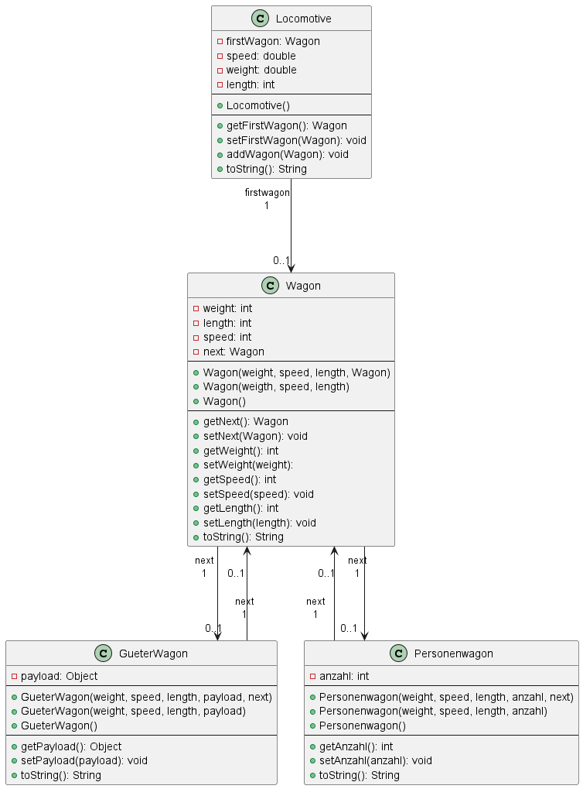

# Lokomotive
## Aufgabenstellung

* Erstelle eine `Lokomotive` mit `Gueterwagon` und `Personenwagon`.
* Die verschiedenen Wagons sollen mit Klassen gemacht werden die von `Wagon` erben.
* Die Wagons brauchen folgende Informationen speed, weight, length.
* Da Güter- und Personenwagons verschieden Arten von Wagons sind geben sie auch etwas spezielles mit. Für Güterwagons gibt es payload und für Personenwagons gibt es anzahl.
* Klassendiagramm unten

### Gebraucht
| Variablen | What you need to know                                                                                           |
|-----------|-----------------------------------------------------------------------------------------------------------------|
| Weight    | Weight soll als kg angeben werden und dann vor der Ausgabe zu Tonnen umgewandelt werde                          |
| Speed     | Speed bekommt man durch das zusammenrechen der Geschwindigkeiten der Wagons und an durch die Anzahl der Wagons. |
| Length    | Length bekommt man durch das zusammenrechen von allen Wagons + der Lokomotive (23m).                            |
| Anzahl    | Die Anzahl ist eine spezielle Variable für Personenwagons die muss man nicht zusammenrechnen.                   |
| Payload   | Payload ist die Fracht in dem Güterwagon.                                                                       |
### Ausgabe
````
Wagons:
Anzahl an Menschen: 120
Nutzlast: Kuh
Anzahl an Menschen: 64

Kompletter Zug:
Weight: 45,00 t
Speed: 137,50 km/h
Länge: 105 m
````

## Klassendiagramm

````
____   ____.__       .__      _________                          ._.
\   \ /   /|__| ____ |  |    /   _____/__________    ______ _____| |
 \   Y   / |  |/ __ \|  |    \_____  \\____ \__  \  /  ___//  ___/ |
  \     /  |  \  ___/|  |__  /        \  |_> > __ \_\___ \ \___ \ \|
   \___/   |__|\___  >____/ /_______  /   __(____  /____  >____  >__
                   \/               \/|__|       \/     \/     \/ \/
````